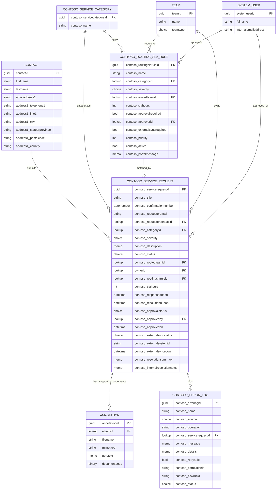

# Contoso Service Intake ERD

## Relationship Notes

- `Service Request` is user/team owned and is assigned to the routed owner team by the plugin.
- `Routed Team` is retained as an audit/reporting lookup even if `ownerid` is later reassigned.
- `Routing/SLA Rule` is organization owned so administrators can maintain the routing matrix without creating per-user ownership complexity.
- `Annotation` stores portal-uploaded supporting documents through Power Pages notes/timeline configuration.
- `Integration/Error Log` stores plugin, flow, portal, and external API failures for operational review.
